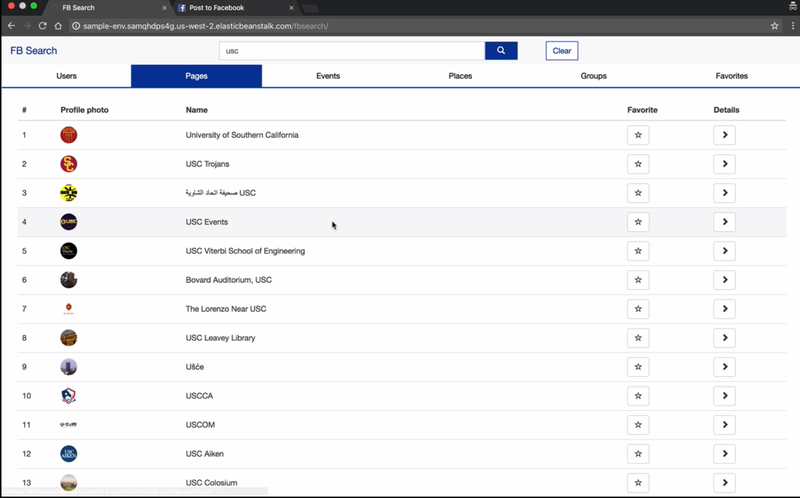

# Project Facebook Search

## 1 AngularJS + PHP(On AWS EC2 Instance)

**Demo Video Link**: [https://www.youtube.com/watch?v=KwaH1_VxOLw]（https://www.youtube.com/watch?v=KwaH1_VxOLw）

## 2 Android(On Nexus 5X)

**Demo Video Link**: [https://www.youtube.com/watch?v=zc-oR3UFYGg](https://www.youtube.com/watch?v=zc-oR3UFYGg)

